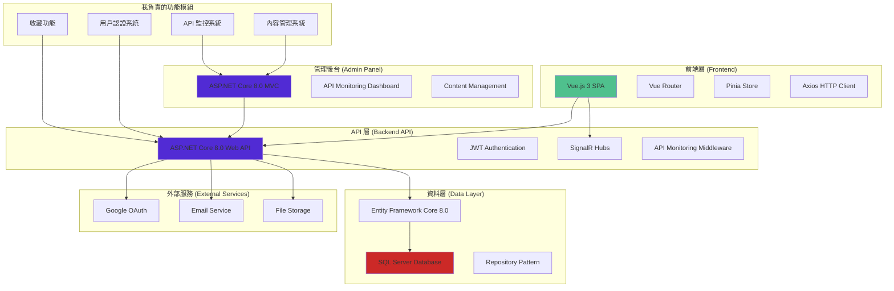
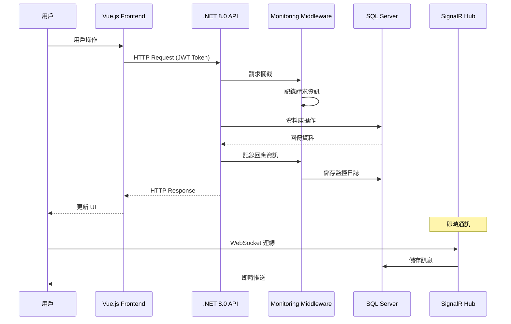

# 資策會畢業專題：CaseScene (全端接案媒合平台)

這是我在資策會與 2 位組員共同協作的全端畢業專題。

**[注意]：由於此專案為團隊共同持有，原始碼庫未設為公開。我非常樂意在面試中攜帶筆電，親自展示我負責的功能模組與程式碼。**

> 基於 .NET 8.0 + Vue.js 3 的自由工作者媒合平台，整合專案管理、即時通訊、論壇社群等完整功能

[](https://dotnet.microsoft.com/)
[](https://vuejs.org/)
[](https://www.microsoft.com/sql-server)
[](LICENSE)

## 目錄

- [專案概述](#專案概述)
- [系統架構](#系統架構)
- [使用技術](#使用技術)
- [核心功能](#核心功能)
- [API 文檔](#api-文檔)
- [專案結構](#專案結構)
- [開發指南](#開發指南)

## 專案概述

CaseScene 是一個現代化的自由工作者媒合平台，提供完整的專案管理、人才媒合、即時通訊等功能。採用前後端分離架構，支援多角色用戶系統，並整合了企業級的 API 監控和安全機制。

## 我負責的功能模組

在這個三人團隊專案中，我主要負責以下核心功能的設計與開發：

### 用戶認證系統

- **登入/註冊功能** - JWT 身份驗證與 Google OAuth 整合
- **個人資料管理** - 用戶資料編輯、頭像上傳、密碼重設

### 網站核心頁面

- **首頁設計** - 響應式首頁布局與用戶體驗優化
- **導航系統** - 全站導航架構與路由管理

### 內容管理系統

- **公告區功能** - 公告發布、分類管理、跑馬燈效果
- **幫助中心** - 幫助文章管理、分類導航、搜尋功能

### 用戶互動功能

- **收藏系統** - 專案收藏、專家收藏功能

### 後台管理系統

- **API 監控儀表板** - 即時 API 效能監控與視覺化
- **內容管理後台** - 公告與幫助文章的 CRUD 操作
- **系統警報機制** - 自動化監控與警報通知

### 主要技術亮點

- **JWT 身份驗證** - 安全的用戶認證系統
- **API 監控** - 完整的 API 效能監控和警報系統
- **內容管理** - 動態內容發布與管理
- **響應式設計** - 支援各種設備的現代化 UI
- **用戶體驗** - 流暢的前端互動與視覺效果

## 系統架構



### 資料流架構



## 使用技術

### 後端技術

- **框架**: .NET 8.0 (LTS)
- **Web API**: ASP.NET Core 8.0
- **ORM**: Entity Framework Core 8.0
- **資料庫**: SQL Server 2022
- **認證**: JWT Bearer Authentication
- **即時通訊**: SignalR
- **API 文檔**: Swagger/OpenAPI

### 前端技術

- **框架**: Vue.js 3 (Composition API)
- **路由**: Vue Router 4
- **狀態管理**: Pinia
- **HTTP 客戶端**: Axios
- **UI 組件**: 自定義組件庫
- **圖表**: Chart.js
- **樣式**: CSS3 + 響應式設計

### 開發工具

- **IDE**: Visual Studio 2022 / VS Code
- **版本控制**: Git
- **API 測試**: Postman
- **資料庫管理**: SQL Server Management Studio

## 核心功能

### 用戶管理系統 (我負責)

- 多角色用戶註冊 (發案者/接案者)
- JWT 身份驗證與授權
- Google OAuth 第三方登入
- 個人資料管理與頭像上傳
- 密碼重設與 Email 驗證

### 專案媒合系統

- 專案發布與管理
- 智能人才推薦
- 提案與邀請機制
- 專案進度追蹤
- 評價與回饋系統

### 即時通訊系統

- SignalR 即時聊天
- 多人聊天室
- 檔案分享功能
- 訊息狀態追蹤
- 通知系統

### 公告與內容管理 (我負責)

- 公告發布與分類管理
- 跑馬燈公告效果
- 幫助中心文章系統
- 內容搜尋與導航
- 動態內容更新

### 收藏功能 (我負責)

- 專案收藏與管理
- 專家收藏功能
- 收藏列表展示
- 收藏狀態同步

### API 監控系統 (我負責)

- 即時 API 效能監控
- 請求/回應時間追蹤
- 錯誤率統計與警報
- 視覺化監控儀表板

## API 文檔

API 文檔可通過 Swagger UI 查看：

- 開發環境: `https://localhost:7068/swagger`

### 主要 API 端點

| 功能模組 | 端點                | 描述                     | 負責人     |
| -------- | ------------------- | ------------------------ | ---------- |
| 認證     | `/api/account/*`    | 用戶註冊、登入、資料管理 | **我負責** |
| 內容管理 | `/api/contents/*`   | 公告與幫助文章管理       | **我負責** |
| 收藏     | `/api/favorites/*`  | 收藏功能 API             | **我負責** |
| 監控     | `/api/monitoring/*` | API 監控數據             | **我負責** |
| 專案     | `/api/projects/*`   | 專案 CRUD 操作           | 組員負責   |
| 聊天     | `/api/chat/*`       | 聊天室管理               | 組員負責   |
| 論壇     | `/api/forum/*`      | 論壇文章與回覆           | 組員負責   |

## 專案結構

```
CaseScene/
├── 📁 CaseSceneWebAPI/          # .NET 8.0 Web API
│   ├── 📁 Controllers/          # API 控制器
│   ├── 📁 Models/              # 資料模型
│   ├── 📁 Services/            # 業務邏輯服務
│   ├── 📁 Middleware/          # 中介軟體
│   ├── 📁 Hubs/               # SignalR Hubs
│   └── 📁 DTO/                # 資料傳輸物件
├── 📁 CaseSceneMVC/            # .NET 8.0 MVC 管理後台
│   ├── 📁 Controllers/         # MVC 控制器
│   ├── 📁 Views/              # Razor 視圖
│   └── 📁 Models/             # 視圖模型
├── 📁 case/CaseSceneProject/CaseSceneVue/  # Vue.js 3 前端
│   ├── 📁 src/
│   │   ├── 📁 components/      # Vue 組件
│   │   ├── 📁 views/          # 頁面視圖
│   │   │   ├── 📁 auth/       # 登入註冊頁面 (我負責)
│   │   │   ├── 📁 account/    # 個人資料頁面 (我負責)
│   │   │   ├── 📁 collection/ # 收藏頁面 (我負責)
│   │   │   └── 📁 ...         # 其他頁面
│   │   ├── 📁 stores/         # Pinia 狀態管理
│   │   ├── 📁 services/       # API 服務
│   │   └── 📁 utils/          # 工具函數
│   └── 📁 public/             # 靜態資源
└── 📄 README.md               # 專案說明
```

## 開發指南

### 程式碼規範

- 後端遵循 C# 編碼規範
- 前端使用 ESLint + Prettier
- 資料庫使用 DataBase First 方式

### Git 工作流程

```bash
# 功能開發
git checkout -b feature/new-feature
git commit -m "feat: add new feature"
git push origin feature/new-feature

# 建立 Pull Request
```


## 效能監控

### API 監控功能

- 請求/回應時間追蹤
- 錯誤率統計
- 端點使用分析
- 用戶行為追蹤
- 自動警報系統

### 監控儀表板
- 即時 API 效能數據
- 視覺化圖表分析
- 系統健康狀態

##  開發團隊

**團隊專案** - 資策會畢業專題 (3 人團隊)

- **我的貢獻**: 用戶認證、內容管理、API 監控、收藏功能
- **組員貢獻**: 專案媒合、即時通訊、論壇系統

**聯絡方式**

- 如需查看完整程式碼，面試時可攜帶筆電展示我負責的所有功能模組與技術實作

## 面試展示重點

### 我可以展示的技術能力：

- **.NET 8.0 Web API** 開發與架構設計
- **Vue.js 3** 前端組件開發與狀態管理
- **JWT 身份驗證** 完整實作流程
- **API 監控系統** 企業級監控解決方案
- **響應式網頁設計** 與用戶體驗優化
- **資料庫設計** 與 Entity Framework Core 應用

### 可現場展示的功能：

1. 完整的用戶註冊登入流程
2. API 監控儀表板即時數據
3. 內容管理系統操作
4. 收藏功能前後端整合
5. 響應式設計適配效果

---

**歡迎面試時詳細討論技術實作細節與架構設計思路！**
